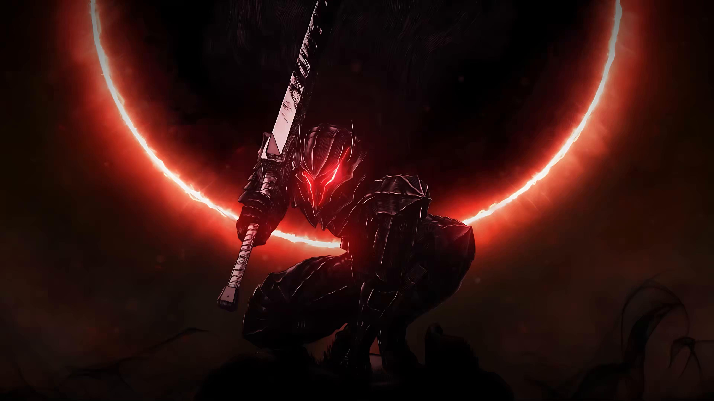

  

<h1 align="center">
  
</h1>

  
  
  
  
  

  <i>"In this world, is the destiny of mankind controlled by some transcendental entity or law? Like the hand of God hovering above? At least it is true that man has no control, even over his own will."</i>

  

<h3 align="center">🩸 The Origin Story</h3>

  <i>Born from darkness, tempered by endless trials, and marked to fight against impossible odds.</i>

  I am <b>Sahil Choudhary</b>, an AI & Autonomous Systems Developer at <b>IIT (ISM) Dhanbad</b>. Like a lone swordsman wielding a weapon too heavy to be called a sword, I carve through complex software problems, multi-agent frameworks, large-scale data pipelines, and deep learning architectures.

  

<h3 align="center">⚔️ The Arsenal (Tech Stack)</h3>

<h4 align="center">🤖 AI, Machine Learning & Frameworks</h4>

  
  
  
  
  
  

<h4 align="center">💻 Programming Languages & Databases</h4>

  
  
  
  

<h4 align="center">🌐 Web, Cloud & Infrastructure</h4>

  
  
  
  
  

 

  

  <b>⚔️ Struggle. Contend. Build. ⚔️</b>

