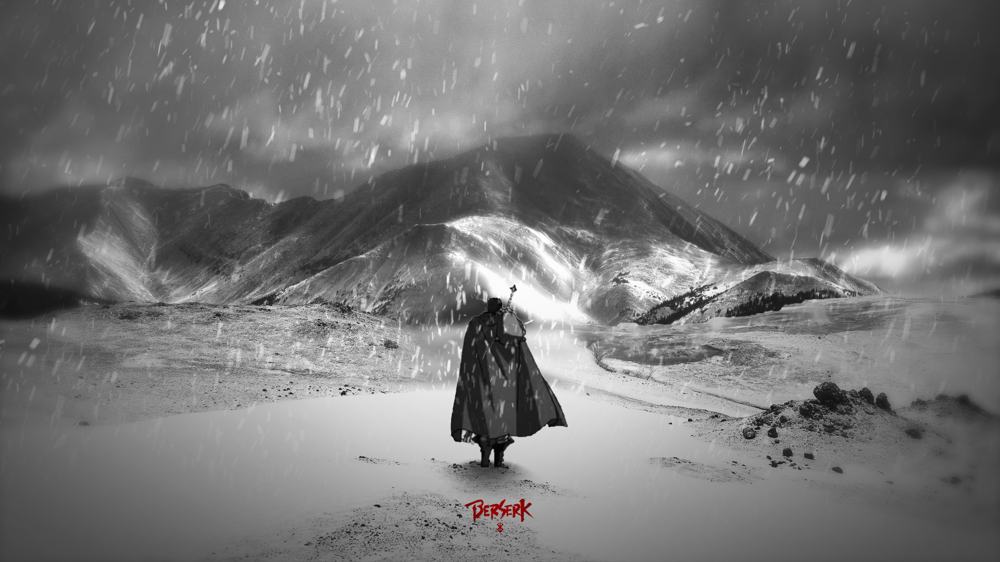

  

<h1 align="center">
  
</h1>

  

  <i>"In this world, is the destiny of mankind controlled by some transcendental entity or law? Like the hand of God hovering above? At least it is true that man has no control, even over his own will."</i>

---

### 🩸 The Origin Story

> *Born from darkness, tempered by endless trials, and marked to fight against impossible odds.*

I am **5AIhil**, a vigilante developer wandering through the realm of code. Like a lone swordsman wielding a weapon too heavy to be called a sword, I carve through complex software problems, ruthless bugs, and raw data.

Driven by an unyielding spirit to create, I build intelligent systems and high-caliber digital experiences in the dead of night. Marked by relentless curiosity, I do not yield to broken builds or daunting architectures—I **struggle, contend, and build.**

 

  

---

### ⚔️ The Arsenal (Tech Stack)

  
  
  
  
  
  
  

---

### 🗡️ Active Quests (Current Endeavors)

- 🩸 **Forging AI Artifacts**: Architecting autonomous agents and deep learning models powered by PyTorch, TensorFlow & Python.
- ⚡ **Constructing Web Systems**: Crafting blood-fast, resilient web applications using React & scalable cloud backends.
- ⛓️ **Containerizing Environments**: Hardening deployment pipelines with Docker & AWS infrastructure.
- 🌌 **Conquering New Frontiers**: Pushing the boundaries of Artificial Intelligence, neural networks, and system design.

 

  

---

  "He who fights with monsters should see to it that he himself does not become a monster." 
  <b>⚔️ Struggle on, fellow developer. ⚔️</b>

